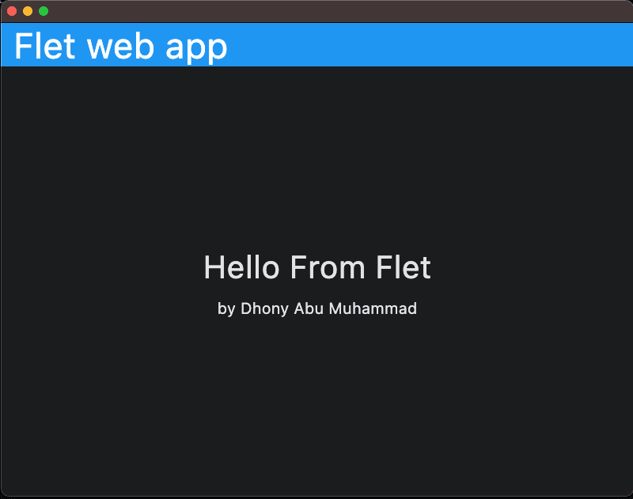
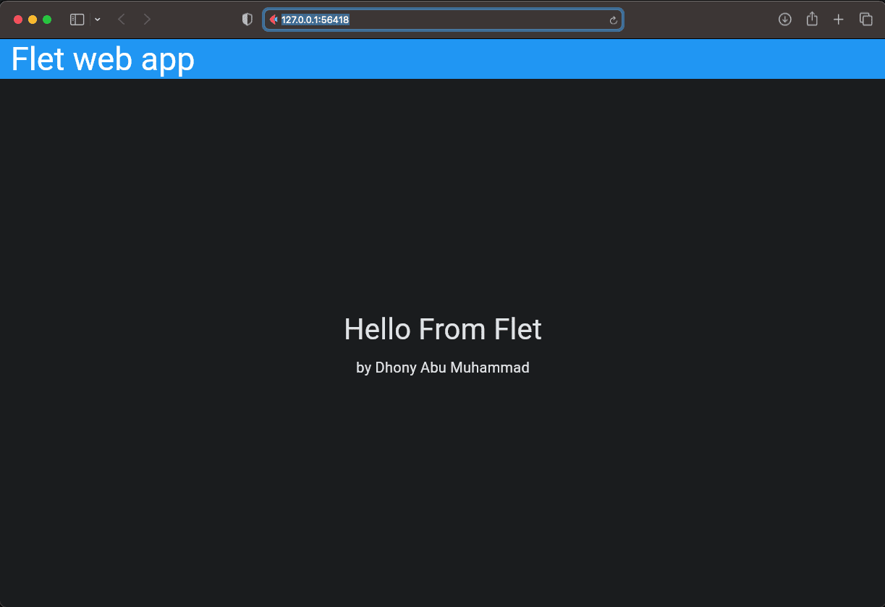

# Flet app HELLO run Local

### Begin Project :

    ❯ python -m venv venv

    ❯ source ./venv/bin/activate

    ❯ pip install flet

### Code :

    import flet as ft

    def main(page: ft.Page):

        appbar = ft.AppBar(
            title = ft.Text("Flet web app", size=45, color="white"),
            bgcolor = "blue"
        )

        page.vertical_alignment = ft.MainAxisAlignment.CENTER
        page.horizontal_alignment = ft.CrossAxisAlignment.CENTER

        content_1 = ft.Container(
            content = ft.Column([
                ft.Text("Hello From Flet", size=40)
            ])
        )

        content_2 = ft.Container(
            content = ft.Column([
                ft.Text("by Dhony Abu Muhammad", size=20)
            ])
        )

        page.add(appbar, content_1, content_2)

    ft.app(target=main, view=ft.WEB_BROWSER)

### &#x1F3C3; Run :

command for deploy desktop app

    ❯ flet run main.py

        http://127.0.0.1:54993

    # or 

    ❯ flet main.py -d 

        http://127.0.0.1:54993

command for deploy web

    ❯ flet run --web main.py

        http://127.0.0.1:56418

    # or 

    ❯ flet main.py -w

        http://127.0.0.1:56418

### Result :

    

desktop apps

    

web

### Notes :

    ❯ flet --version

        0.21.1

    ❯ pip list

        Package               Version
        --------------------- ---------------
        annotated-types       0.6.0
        anyio                 4.3.0
        arrow                 1.3.0
        binaryornot           0.4.4
        certifi               2024.2.2
        chardet               5.2.0
        charset-normalizer    3.3.2
        click                 8.1.7
        cookiecutter          2.6.0
        exceptiongroup        1.2.0
        fastapi               0.110.0
        flet                  0.21.1
        flet-core             0.21.1
        flet-runtime          0.21.1
        h11                   0.14.0
        httpcore              1.0.4
        httptools             0.6.1
        httpx                 0.27.0
        idna                  3.6
        Jinja2                3.1.3
        markdown-it-py        3.0.0
        MarkupSafe            2.1.5
        mdurl                 0.1.2
        oauthlib              3.2.2
        packaging             23.2
        pip                   22.0.4
        pydantic              2.6.3
        pydantic_core         2.16.3
        Pygments              2.17.2
        pypng                 0.20220715.0
        python-dateutil       2.9.0.post0
        python-dotenv         1.0.1
        python-slugify        8.0.4
        PyYAML                6.0.1
        qrcode                7.4.2
        repath                0.9.0
        requests              2.31.0
        rich                  13.7.1
        setuptools            58.1.0
        six                   1.16.0
        sniffio               1.3.1
        starlette             0.36.3
        text-unidecode        1.3
        types-python-dateutil 2.8.19.20240106
        typing_extensions     4.10.0
        urllib3               2.2.1
        uvicorn               0.27.1
        uvloop                0.19.0
        watchdog              4.0.0
        watchfiles            0.21.0
        websockets            12.0